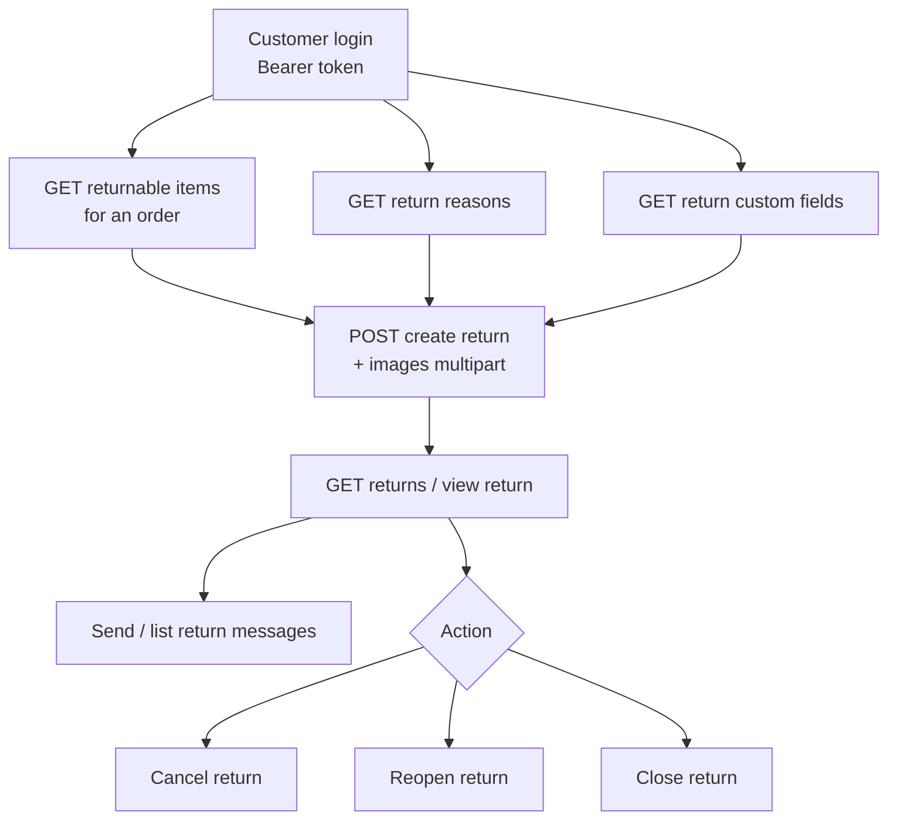

# Returns / RMA (Shop)

A customer files a return against a delivered order, then tracks and messages on it. The flow: find the returnable items on an order, pick a reason, collect the store's custom fields, create the return, then track / message / cancel / reopen / close it.

## Prerequisites

- A valid storefront key ([Setup](/api/setup), [Authentication](/api/authentication)).
- A logged-in customer (Bearer `token`).
- An order with returnable items — returns are only offered for eligible, delivered items.

## Dependency diagram

## Ordered call table

| # | Step | Endpoint | Depends on | Note |
|---|------|----------|-----------|------|
| 1 | List returnable items | [GET returnable items](/api/rest-api/shop/returns/list-returnable-items) · [GraphQL](/api/graphql-api/shop/returns/queries/list-returnable-items) | an eligible order | Which items on the order can be returned |
| 2 | List return reasons | [GET reasons](/api/rest-api/shop/returns/list-return-reasons) · [GraphQL](/api/graphql-api/shop/returns/queries/list-return-reasons) | storefront key | Populate the reason dropdown |
| 3 | List return custom fields | [GET custom fields](/api/rest-api/shop/returns/list-return-custom-fields) · [GraphQL](/api/graphql-api/shop/returns/queries/list-return-custom-fields) | storefront key | The store's extra questions; required ones must be answered |
| 4 | Create return | [POST create return](/api/rest-api/shop/returns/create-return) · [GraphQL](/api/graphql-api/shop/returns/mutations/create-return) | returnable items + a reason + the custom fields | Files the RMA request. Send `order_item_id` from step 1 — the order line id, not a product id. Post as `multipart/form-data` with `images[]` to attach photos |
| 5 | Track returns | [list](/api/rest-api/shop/returns/list-returns) · [view](/api/rest-api/shop/returns/view-return) · [GraphQL](/api/graphql-api/shop/returns/queries/list-returns) | a created return | Status + history |
| 6 | Messages | [send](/api/rest-api/shop/returns/send-return-message) · [list](/api/rest-api/shop/returns/list-return-messages) · [GraphQL](/api/graphql-api/shop/returns/mutations/send-return-message) | a return | Back-and-forth with the store |
| 7 | Cancel / Reopen / Close | [cancel](/api/rest-api/shop/returns/cancel-return) · [reopen](/api/rest-api/shop/returns/reopen-return) · [close](/api/rest-api/shop/returns/close-return) | a return in the right state | State transitions |

> **GraphQL equivalents:** `customerReturns` / `customerReturn` (track), `returnableItems`, `returnReasons`, `returnCustomFields`, and the `createCustomerReturn` / `cancelCustomerReturn` / `reopenCustomerReturn` / `closeCustomerReturn` / `sendReturnMessage` mutations. Select **result fields** (not `id`) on the mutation payloads — see [Identifiers](/api/graphql-api/identifiers).

## End-to-end sequence

returnable items + reasons + custom fields → create return → view return (track) → send message (if needed) → cancel / reopen / close.

State transitions are gated: an action that doesn't apply to the return's current state returns an error (see [Errors](/api/errors)).

Three things reject a create that otherwise looks right:

- `order_item_id` holding a **product** id instead of the order line id from step 1 — the API answers `The selected item is not eligible for return.`
- `package_condition` outside `open` / `packed`
- a custom field marked `isRequired` left unanswered

Attaching photos is REST-only and happens while creating the return (multipart `images[]`, checked against the mime types the store allows) — there is no separate upload endpoint. Units held by a canceled or declined return are released, so a shopper who withdrew a request can file a new one for the same item.

## Customize

Every call below links to its **REST** endpoint page for concreteness. The sequence is transport-agnostic — the same flow works over GraphQL with the equivalent query or mutation, and each REST page cross-links to its GraphQL twin. Pick whichever transport your client uses; only the request shape changes, never the order of steps.

To change return behavior on the server, see [Customization → Shop](/api/workflows/customization/).
